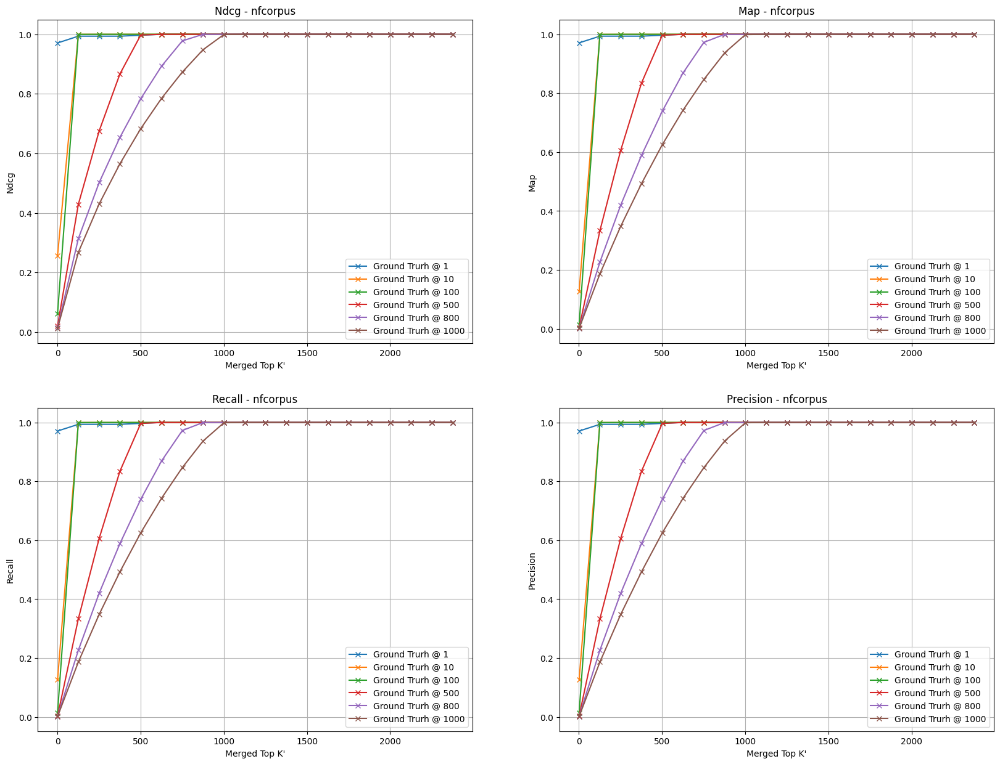

# Sparse-Dense_Retrieval
Retrieve the top-𝑘 documents with respect to a given query by maximal inner product over dense and sparse vectors. This probelm is solved by breaking the maximal inner product int two smaller MIPS problem:
- Retrieve the top-𝑘' documents from a sparse retrieval system defined over the sparse portion of the vectors
- Retrieve the top-𝑘' documents from a dense retrieval system defined over the dense portion of the vectors

Before merging the two sets and retrieving the top-𝑘 documents from the combined (much smaller) set. As 𝑘' approaches infinity, we see the final top-𝑘 ecoming exact, with the drowback that the retrieval becomes much slower.

The dataset that we decide to use are: [nfcorpus](https://www.cl.uni-heidelberg.de/statnlpgroup/nfcorpus/) and [scifact](https://github.com/allenai/scifact)

## Application Workflow
- Download the wanted dataset using Beir
- Pre-processing the queries and documents text
- Retreive the sparse embedding using the Elastic Search implementation of BM25 or the implemented version
- Retreive the dense embedding using SentenceBert
- Obtaining the ground truth score and document rank at k for each query 
- Obtaining the merged embedding using the dense and sparse representation at k'
- Retreive the results over the ground truth at k and the merged version at k

## Results
* **scifact dataset results**
* **nfcorpus dataset results**
